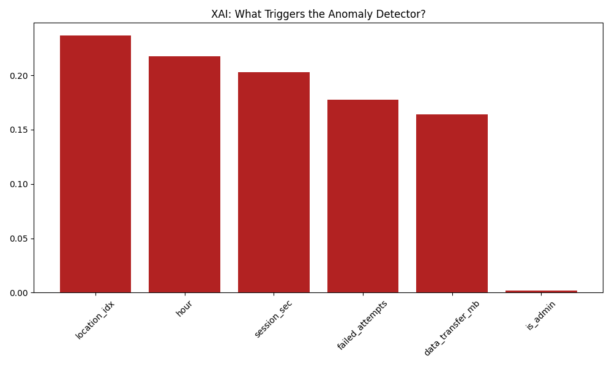
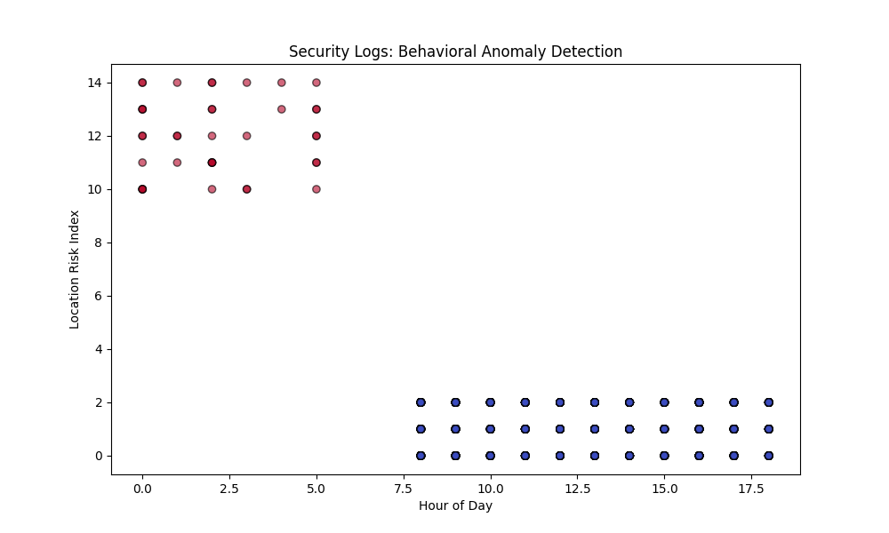

# 🧠 Concept Explainer: Intelligent Log Anomaly Detection

### 📌 Overview

Traditional Security Information and Event Management (SIEM) systems use static rules (e.g., "Alert if > 5 failed logins"). However, attackers can bypass these by staying just under the threshold. This project uses **Unsupervised Learning** to detect multidimensional patterns that deviate from the norm.

### 🏗️ Why Isolation Forest?

Unlike standard models that try to define "normal," the **Isolation Forest** works by "isolating" anomalies. Since anomalies are few and different, they are easier to isolate in a tree structure than normal points.

[Image of an anomaly detection process using Isolation Forest to identify outliers in a data cluster]

### 🛰️ System Observability & Logging

In enterprise security, a script must be more than "black box" code. We have implemented a professional logging and monitoring layer:

- **Standardized Logging**: Using Python’s `logging` library, the system tracks the lifecycle of the AI—from data ingestion to the final SOAR trigger—ensuring a forensic audit trail is available if the script fails.
- **Real-Time Feedback**: Integration with `tqdm` provides visual progress bars during the **Detection** and **XAI** phases, allowing analysts to monitor heavy processing tasks in real-time.
- **Error Handling**: The pipeline includes `try-except` blocks and `CRITICAL` log levels to ensure that data corruption or missing files are handled gracefully without crashing the security monitoring loop.

### 🔍 Explainable AI (XAI): The "Why" Behind the Alert

Unsupervised models often tell you _that_ something is wrong, but not _what_ is wrong. To solve this, we implemented a **Surrogate Explainer model**:

1. **The Surrogate Loop**: We take the detections from the Isolation Forest and use them as labels to train a supervised **Random Forest Classifier**.
2. **Feature Attribution**: We extract the `feature_importances_` to calculate which variables (e.g., `location_idx` vs `session_sec`) contributed most to the anomaly score.
3. **Analyst Context**: This transforms a generic alert into a specific insight: _"Alert: Anomalous Admin Login. Reason: 85% driven by unusual Location Index."_

### 📊 Model Interpretability: Feature Importance

_By utilizing the XAI wrapper, we identify the "Red Flags." This prevents 'Alert Fatigue' by allowing analysts to prioritize alerts based on critical risk factors._

[Image of a feature importance bar chart showing various network metrics and their weights in a machine learning model]

### 🛡️ Real-World Impact

This model can detect **Low-and-Slow attacks** by correlating features:

- A user logging in at 3 AM (Anomaly in `hour`).
- Combined with a high data transfer (Anomaly in `data_transfer_mb`).
- Executed via an Admin account (Anomaly in `is_admin`).

### 📉 Visual Output: Detection Results

_This scatter plot highlights outliers (in red) based on the correlation between login time and location risk._

### 🔄 The Running Process (Detection Lifecycle)

To maintain continuous security monitoring, the detector follows a four-stage automated process:

1. **Data Ingestion**: Monitors `data/system_logs.csv` for new events.
2. **Unsupervised Training**: The Isolation Forest builds random trees; outliers are flagged.
3. **XAI Evaluation**: The Surrogate model calculates the "Why" behind the flag.
4. **Response Trigger (SOAR)**: Anomalies execute `pipeline_integration.py` to trigger an Nmap audit.

[Image of an automated incident response workflow (SOAR) showing detection, enrichment, and remediation steps]
